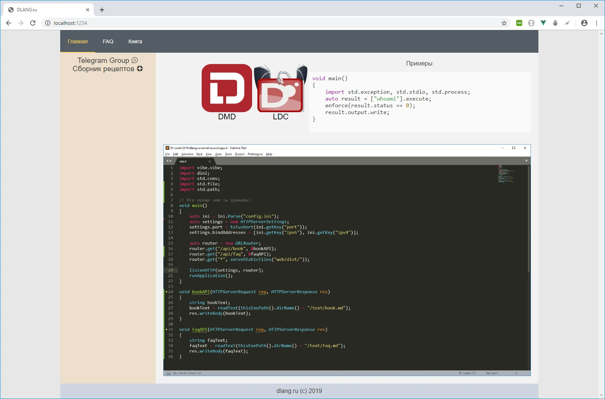

### About
Russian community site about D Programming language.

### Book

You are free to contribute to dlang.ru/book

### Contacts

Our Telegram channel https://t.me/dlangru

### Attention

Site may not be open from Russia due to blocking from our goverment.
Putin is a fascist! We do not support the military annexation of the Crimea!

### Screenshot

### Setup

nodejs should be installed 

`cd app_dir`

`cd web`

change prebuild command in package.json from `rmdir /s/q dist` to `rm -rf dist`

run `npm install` if first run

`npm run build`

`cd ..`

add to `dub.sdl`
`dflags "-lowmem"`

run 
`dub build`

if VPS have less than 2GB RAM you need pass the flag `--build-mode=singleFile`

Do not forget to change `globalThis.base_url = "http://127.0.0.1:8081"` to current domain name.

### Running

`cp ./dlangru-deamon.service /etc/systemd/system/dlangru-deamon.service`

`sudo systemctl enable dlangru`