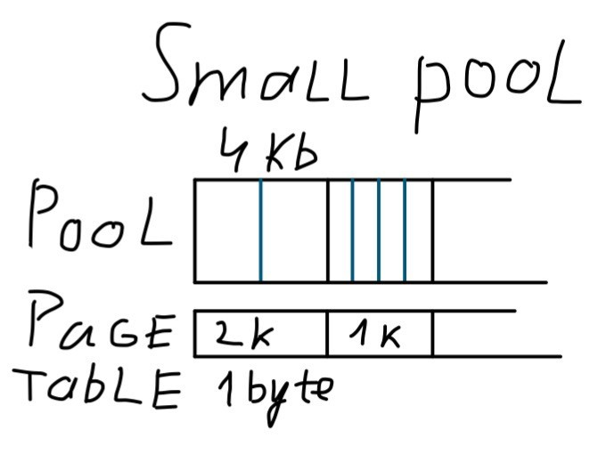
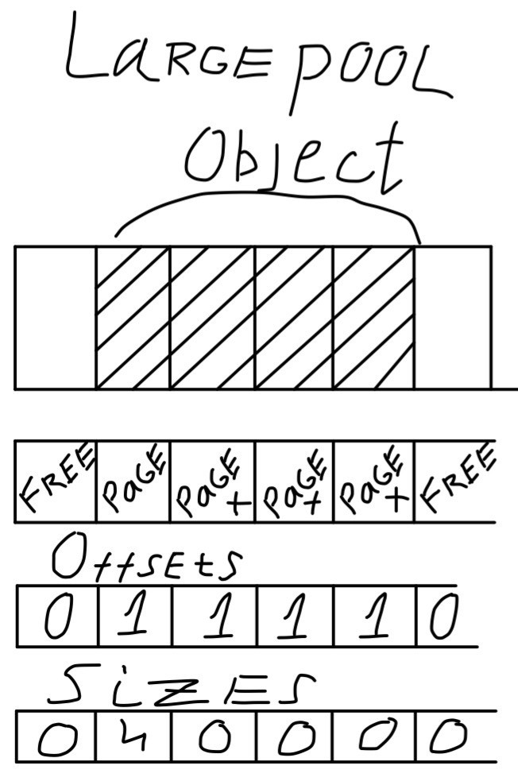

# DConf-2017. Под капотом мусорщика D (Дмитрий Ольшанский)

**Оригинал (англ.)**: http://olshansky.me/gc/runtime/dlang/2017/06/14/inside-d-gc.html

**Перевод**: Глеб Куликов (https://yadi.sk/i/dftROrt33KLww6)

**Небольшие правочки**: DarkRiDDeR (24.06.2017)

---

Во время проходившего на конференции DConf-2017 хакатона, я самоуверенно возглавил группу из двух человек, хакающих Ди’шный сборщик мусора (GC). После нескольких часов я уже не мог избавиться от навязчивой мысли «эгей, парень, это надо бы переписать!». Так что я решил отправиться в квест в поисках лучшего мусорщика для Ди, где первым шагом стал бы более быстрый, клаcсический сборщик, отмечающий достижимые объекты (mark-sweep).

Для пояснения моих мотивов, я намерен описать внутренности современного сборщика, отмечая промахи архитектуры. В конце концов, надо же понять, «куды тыкать»!

## Пулы, везде пулы!

гнорируя излишние детали, мусорщик — это просто массив объектов пула. Каждый пул — это кусочек отображённой (mmap) памяти + немного метаданных в куче (таблиц маркирующих бит, освобождающих бит ну и так далее). Выделение памяти происходит внутри пула. Если одиночный пул не в состоянии обслужить выделение памяти, заводится новый пул. Размер пула определяется арифметической прогрессией от числа пулов (или 150% от размера выделения, смотря, что окажется больше).

Важно, что пулы бывают двух типов, для больших и маленьких объектов. В «маленьких» пулах выделяются объекты размером до 2 Кб, всё остальное обслуживается «большими» пулами. На самом деле, маленькие пулы более интересны, так что давайте на них первым делом и взглянем.

Прежде всего, размер памяти для любого маленького выделения округляется до подходящего (по степеням двойки) класса размера — 16, 32, 64, 128, 256, 512, 1024, 2048. Затем для данного размера проверяется глобальный список свободных блоков и, если такового найти не получается, продолжается поиск маленького пула.

Маленький пул выделит новую страницу памяти и внесёт её в список свободных блоков данного размера. Вот и «вылезла» первая большая ошибка существующей архитектуры: класс размера назначается на страничной основе, поэтому нам требуется таблица (чтобы жизнь мёдом не казалась, называемая таблицей страниц), ставящая в соответствие каждому классу размера соответствующую страницу. Теперь, чтобы найти начало объекта по внутреннему указателю, мы сперва ищем страницу, к которой он принадлежит, затем ищем класс размера и, наконец, накладываем битовую маску. Более того, метаданные представляют собой кучу простых битовых таблиц, которые теперь должны покрывать страницы разного размера, поэтому на каждые 16 байт требуется примерно 7 бит независимо от размера объекта.

Чем была обусловлена эта архитектура? У меня на этот счёт есть две гипотезы. Первая связана с нежеланием резервировать память для недоиспользуемых пулов (что, на самом деле, не является проблемой, так как для виртуальной памяти работает ленивая фиксация). Вторая — с опасениями получить слишком много пулов, замедлив выделение и полезную маркировку. Последнее больше похоже на причину, так как во время фазы маркировки, мусорщик действительно довольно часто производит линейное сканирование по пулам и бинарный поиск для каждого предполагаемого указателя (!).

Вот и вторая ошибка: поиск пула за log(P), где P — число пулов, и соответственно, отметка за N*log(P). Хэш–таблица могла бы малость сэкономить циклы.

Завершая наш обзор маленького пула, мы также должны взглянуть на выбор классов размеров. Это третья погрешность (не ошибка, скорее, спорный выбор): размеры, следующие степеням двойки, гарантируют нам внутреннюю фрагментацию, доходящую до 50 %. Современные выделители, подобные jemalloc’у, обычно предлагают ещё один класс, размер которого лежит между степеням двойки. Деление по модулю на константу, не являющуюся степенью двойки, несколько медленнее одиночного битового, но и вполне приемлемо.

Давайте взглянем на пулы больших объектов. Первое, что нужно заметить, так это гранулярность страницы памяти (4 КБ) как для метаданных, так и собственно выделений памяти. Наборы свободных страниц внесены в один список, который линейно сканируется при каждом запросе на выделение памяти. Это четвёртая ошибка, которая, впрочем, не оказывает влияния на производительность выделения больших объектов. Для поиска начала объекта организована отдельная таблица, в которой для каждой страницы хранится индекс начала объекта, к которой он принадлежит.

Схема разумна до тех пор, пока не коснётся больших (более 100 МБ) выделений памяти. В этом случае, скорее всего, не удастся перераспределить память «по месту», в результате чего будет выделен новый пул и огромный объём памяти метаданных будет истрачен на всего один объект.
Процесс сбора

До сих пор мы наблюдали конвейер выделения памяти, освобождение проходит примерно также. Более интересен автоматический возврат памяти, который и является смыслом сборщика мусора. Прежде всего позвольте мне отметить очевидное: во первых, сборщик мусора в Ди является консервативным, то есть, он не знает, является ли что-то указателем или нет. Во-вторых, он поддерживает финализаторы — действия, которые выполняются на объекте, прежде чем возвратить его память в общий пул. Эти два решения сильно ограничивают архитектуру сборщика.

С точки зрения высокого уровня, процесс сборки, как ни странно, представляет собой целостный 4-фазный процесс: подготовка — полная маркировка – подчистка — возврат памяти.

Стадия подготовки даёт наибольшие основания для сомнений. В сущности, для предотвращения сканирования свободной памяти, на этой стадии следовало бы скопировать биты–признаки свободных блоков в биты–признаки отметок. Однако всю малину портит то, что требуется вычислить полное свободное место, для чего перебрать списки свободных блоков. Это уже пятая(хм?) ошибка, потому что резкое распутывание бессчётного количества указателей — явно последнее, что нужно сделать во время «приостановки мира». Лучшей архитектурой было бы переворачивание битов–признаков свободных блоков во время выделения / освобождения памяти, тем более, что список свободных блоков поддерживает указатели на пул для каждого объекта, так что искать нужный пул не потребуется.

Фаза маркировки сводится, на самом деле, к вызову MarkAll, который просто передаёт подходящие участки памяти в маркировочную функцию, заслуживающую более пристального рассмотрения.

- Прежде всего для каждого указателя в области памяти проверяется, попадает ли он в адресный диапазон кучи сборщика (от наименьшего до наибольшего адреса в пуле).
- Затем для поиска правильного пула для данного указателя, применяется «кошмарный» бинарный поиск.
- Независимо от типа пула, производится поиск в таблице страниц текущего пула для того, чтобы определить его класс размера, либо понять, что это большой объект или даже свободная память, которая вовсе не проверяется. Тут есть небольшая оптимизация: в итоге этого поиска становится ясно, с чем имеем дело: с началом большого объекта или продолжением. У нас есть 3 случая: маленький объект, начало большого объекта, либо продолжение большого объекта. Последние случаи идентичны, за исключением всего одного дополни- тельного поиска в таблице.
- Определяется начало объекта, для этого накладывается правильная битовая маска, а также, в случае продолжения большого объекта, просматривается таблица смещений.
- Заметим, что для случая большого объекта имеется специальный бит — признак «без внутреннего указателя», что позволяет игнорировать внутренние указатели на объект.
- И наконец, проверяются и устанавливаются биты отметок, которые не были установлены раньше, или «noscan-биты» — биты-признаки «не сканировать» — добавляются в стек памяти сканирования.

Собственно, это всё, что нужно сказать о функции пометки, не считая забавных манипуляций с ограничением на стек (для того, чтобы избежать переполнения стека всё ещё пытаемся использовать выделение стека).

Упомянутый ранее поиск пула — далеко не единственный недостаток. Имеющее место смешение несканируемой памяти (без указателей) и нормальной памяти в одном и том же пуле, приводит к необходимости дополнительного просмотра битовой таблицы. А ведь если бы мы разделили пулы по классам размеров, можно было бы с лёгкостью избежать просмотра таблицы страниц. Не стоит даже упоминать сомнительную оптимизацию, касающуюся бита–признака «без внутреннего указателя», которая мало того, что делает код небезопасным (объект может быть сметён в мусор, хотя на него всё ещё ссылаются), но ещё и вводит несколько дополнительных проверок по критическому пути для всех больших объектов, включая возможный просмотр битовой таблицы.

Уф, весьма запутанно. Однако, стоит иметь в виду, что фаза отметки — это воистину сердце любого сборщика.

Перейдём теперь к третье фазе — очистки. Ирония в том, что вопреки ожиданиям, в текущем Ди’шном сборщике очиститель вовсе не очищает списки свободных блоков. Всё, что его волнует, так это вызвать финализаторы, если таковые имеются, и установить биты–признаки «свободен» и прочие таблицы. Заметьте, что это требует поиска битов–отметок и соответственно, линейного прохода по памяти каждого пула.

Последняя стадия — возврат освобождённой памяти. На самом деле, на этой стадии перестраиваются списки свободных блоков. и опять это линейный проход по (всем) пулам, но только по маленьким пулам. И опять нужен просмотр таблицы страниц для каждой страницы в пуле. И только для того, чтобы определить её размер. . . определённо, хочется плакать! Основной вопрос без ответа — зачем? Зачем лишний проход? Я долго пытался представить разумную причину, но так и не смог.

Возможно, слабое, но вполне возможное объяснение — «для простоты». По моему мнению, это последняя большая ошибка.

## Чего же там нет?

До сих пор я критиковал то, что бросается в глаза. Пора перейти к тому, что попросту отсутствует.

Кэш нитей — одно из таких больших упущений. Правда, следует помнить, что Ди’шный мусорщик родом из 2000–ых, так что это не удивительно. В любом современном распределителе есть хоть какая-то форма кэша нитей, некоторые даже пытаются поддерживать кэш для каждого процессора. Кэш работает для каждого потока, выделяя память скопом и придерживая сделанные выделения памяти на будущее. Такой подход уменьшает стоимость просмотра разделяемых структур данных кучи. Точнее говоря, мелкозернистые блокировки имеются, но не на уровне всего пула.

Другой пример современного подхода, безусловно ожидаемого в любом мусорщике, это параллельная отметка. Весьма популярны параллельные (или квази–паралелльные) сборщики, в которых отметка и гораздо более редкая очистка и компактификация (операция, которая преобразует топологические пространства в компактные) производятся во время выполнения нитей приложения.

## Заключительные размышления

Это сообщение получилось гораздо длиннее и более подробное, чем бы мне хотелось. Тем не менее, сохраняется его главный посыл: Ди’шный мусорщик медленный не из-за каких–то фундаментальных ограничений, а просто потому, что почти половина решений в его реализации откровенно плоха. Действуя в том же духе легко можно было бы построить медленный и точный «поколенческий» мусорщик, просто из-за отсутствия хороших методик реализации.

Подводя итог, что пытается изменить моя первая попытка:

1. Разделить маленькие пулы по классам размеров.
2. Использовать поиск в пуле с эффективностью O(1).
3. Чтобы избавиться от внутренней фрагментации, попробовать использовать больше классов размеров, в том числе, не кратных степеням двойки (а-ля jmalloc).
4. Упростить маркировку, разделив все пулы по атрибуту «не сканировать».
5. Ввести третий класс пулов для массивных выделений памяти (более 16 МБ), предназначенных исключительно для одиночных объектов.
6. Пулы больших объектов требуют более хитрой работы. Возможно, деревья с ключами на основе длины блока придутся кстати (jemalloc использует красно–чёрные деревья).
7. Надо бы убрать атрибут „без внутреннего указателя“. В текущей реализации он предназначен для борьбы с ложными указателями, что характерно для консервативного мусорщика. Однако это принципиально небезопасно и цена слишком высока. В конце концов, это полностью бессмысленно в 64-битных системах, где собственно и живут ваши серверы.
8. Не нужно «юродство» с многофазной сборкой в цикле „отметка – очистка“. Он должен отмечать и очищать, только и всего.
9. Добиться мелкогранулированной блокировки с самого начала. Я не вижу проблем с блокировками на уровне пула.

Вторая итерация моих усилий будет сосредоточена на более вкусных вещах: кэш потока, параллельная маркировка и одновременная маркировка, использующая трюк с разветвлением (fork).

На третьей итерации (если доживём), ожидаем совершенно новый дизайн, вдохновлённый коллегой immix1 — сборщик, основанный на отметки областей.

На этой оптимистичной ноте я завершаю озвучивание моих планов. Предупреждаю, что собираюсь начать реализацию в Линукс–специфике, медленно доводя её до совместимости с POSIX. Поддержка Windows — отдалённая возможность.
