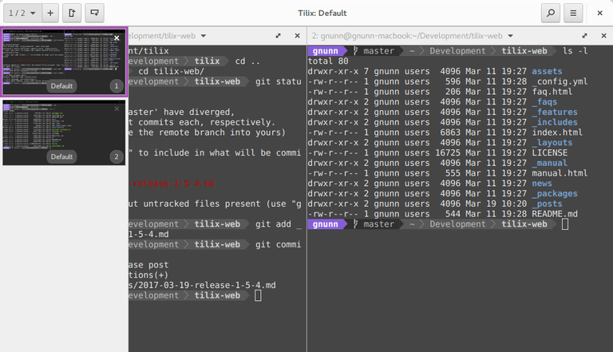

# О Tilix и D: интервью с Геральдом Нанном

**Оригинал (англ.)**: http://dlang.org/blog/2017/08/11/on-tilix-and-d-an-interview-with-gerald-nunn/

**Перевод**: DarkRIDDeR (25.08.2017)

---

**Йоаким** — интервьюер-резидент блога о D. Он также брал интервью у членов D-сообщества для недели D и ответственен за портирование LDC для Android.

**Геральд Нанн** — разработчик Tilix (ранее называвшийся  Terminix).

**Tilix** — продвинутый тайлинговый эмулятор терминалов с открытым исходным кодом, который является самым «звёздным»  проектом на основе D на GitHub, недавно даже обогнавший стандартный компилятор D, DMD. В этом году на DConf в Берлине он рассказывал о том, как использует D. Имеются слайды и видео. В своей повседневной работе, которая не имеет ничего общего с настольными графическими приложениями, он является старшим разработчиком промежуточных решений в Red Hat. [Подробнее об истории Джеральда в расширенном интервью - Ред.]

**Йоаким**: — Что такое тайлинговый эмулятор терминала?

**Геральд**: — Тайлинговый эмулятор терминала позволяет разделить терминал на несколько частей и распределить их в удобном порядке и месте, что наиболее удобно при работе над конкретной задачей. Люди, которые работают на нескольких терминалах одновременно, как правило, находят такие инструменты наиболее полезными, особенно с постоянно увеличивающимися размерами мониторов и разрешений.

Несмотря на то, что Tilix очень хорош, основной причиной, по которой я создал его, было то, что мне нужен был эмулятор терминала, который следовал бы концепции Gnome HIG (Human Interface Guidelines — рекомендации по созданию интуитивных, легко изучаемых и логичных интерфейсов взаимодействия с пользователем) и использовал CSD (Client-Side Decorations — отрисовку на стороне клиента). Tilix следует Gnome HIG, опубликованным здесь, что означает соблюдение интервалов, макетов и других рекомендаций. После HIG важно, чтобы приложение соответствовало всему рабочему столу в целом.

CSD ссылается на заголовок окна, где не диспетчер дисплея, а пользователь берёт на себя ответственность за него и может заполнять панель заголовка кнопками и другими элементами управления. Это часть концепции Gnome HIG, и большинство приложений Gnome (gedit, файлы, видео) по умолчанию используют этот подход. Единственное исключением является gnome-terminal, который вообще не использует CSD.

**Й.**: — Можете привести несколько примеров того, как вы используете концепцию Gnome HIG?

**Г.**: — Gnome HIG определяет конкретный язык дизайна в отношении того, как приложения, работающие в Gnome, должны выглядеть и показывать себя. Некоторые примеры Tilix, следующие концепции HIG, включают использование CSD и меню приложений по рекомендациям, таким как интервалы, макеты и т.д. Кроме того, разработчики Gnome собрали множество макетов, как они думают, как должны выглядеть различные приложения. Tilix использует макеты, разработанные дизайнерами Gnome для терминала, где это возможно. Например, в Tilix диалог предпочтений и профилей использовался отдельно, однако один из дизайнеров Gnome предложил этот макет для gnome-терминала. Я пошел вперед и реализовал его в Тиликсе, гораздо лучше, чем раньше.

В результате использования CSD и концепции Gnome HIG, надеюсь, что использование Tilix в Gnome более органичено для пользователей.

Интересная вещь — это напряженность между людьми, которые используют Tilix на Gnome и тех, кто использует его в других дистрибутивах. Хотя я не имею никаких сомнений в том, что разработка под Gnome является моей основной целью, я стараюсь сделать Tilix лучше и в других средах рабочего стола, разрешив пользователю отключить CSD в пользу обычного заголовка, если они того пожелают.

**Й.**: — Вы попали в D из среды Java. Вы все еще пишете код в стиле Java на D? Это было легко, т.е. сколько вам пришлось привыкать, чтобы писать на D?

**Г.**: — Да, чаще всего работаю с Java. Я нашёл это довольно интересным на DConf, когда я спросил, как много людей пришли не из среды C/C++ , только один человек поднял руку.

Если вы посмотрите на мой код в Tilix, то он очень похож на Java-код. Некоторое из этого связано с моей обычное средой, в которой я работаю, а некоторое из-за того, что GtkD является оболочкой классов. Я считаю, что переключение между D и Java является довольно плавным по большей части; между гораздо меньше когнитивного, чем, скажем, между переключением между Java и Python.

Самая важная идиома D, которую мне пришлось изучить, — это диапазоны, поскольку они являются основополагающей особенностью D. Однако это не было сильно сложным.  Выполнение функций времени компиляции (CTFE) по-прежнему остаются для меня неестественными. Когда я использую их, мне приходится каждый раз искать про них информацию, и мои текущие попытки использования CTFE с точки зрения кода довольны глупы. Я хотел бы больше использовать CTFE в Tilix, поскольку я получаю всё больший опыт использования D.

Наконец, мой недостаток опыта работы с C выявляет другую проблему, с которой я немного борюсь — это взаимодействие с кодом на C. Хотя по большей части это довольно просто, но, когда мне приходится расшифровывать что-то сложное, оно становится не таким простым. Поддержка FlatPak (система изолированных контейнеров для графических приложений) в настоящее время есть, так как мне не приходилось так сильно напрягаться по некоторым вопросам, с которыми я сталкивался на C.

Сказав это, у меня есть некоторый опыт разработки собственного кода, поскольку много лет назад я потратил много времени на разработку кода на Delphi и Object Pascal. Именно на это и приходится большая часть моего опыта работы с графическим интерфейсом.

**Й.**: — И из вашего выступления на DConf вы явное не беспокоились о сборщике мусора (GC). Вам приходилось думать о нём, когда вы разрабатывали Tilix? Имелись ли проблемы задержек с GUI, вызванные GC?

**Г.**: — Придя из Java, GC для меня довольно естественен, и я определенно не считаю его плохим для D. Я думаю, что GC в D получает много плохой прессы на основе опыта Java, но важно помнить, что GC в D сильно отличается от того, что в Java. Самое большое различие для меня в том, что в D есть больше возможностей для его управления, так как он хорошо понимает, когда он может начать цикл GC. Я был очень рад видеть, как больше людей поднимают различные темы на reddit и форумах, жалуются на использование GC.
У меня не было никаких проблем с GC с точки зрения пауз, и ни один пользователь Tilix не сообщал об этом. У меня было несколько проблем, связанных с GC, в основном связанных с утечкой памяти из-за хранения ссылок, но все они были ошибками программного кода, а не проблемой с реализацией GC в D. У меня есть другое приложение на GTK D, Visual Grep, где я столкнулся с ужасающей эффективностью при обработке большого количества совпадений в tight-цикле (цикл, который содержит несколько инструкций и повторяется много раз.). Тем не менее, просто отключив GC для этого раздела кода, ускорилось все.

**Й.**: — Репозиторий github для Tilix замечательно чист, нет открытых запросов Pull (PR) и низкий процент проблем, которые все еще открыты. Сколько времени вы еженедельно тратите на Тиликс? Является ли Tilix только хобби или он стал чем-то большим?

**Г.**: — Тиликс — это просто хобби. Я, вероятно, провожу от 5 до 10 часов в неделю. На данный момент — это зрелое приложение, следовательно, относительно небольшое количество проблем. Я также уделяю приоритетное внимание исправлению ошибок при добавлении новых функций, что помогает сохранить список управляемым.

Что касается запросов на «pull request» (PR), я твердо убежден в том, что я должен быть отзывчивым, поэтому я, как правило, отвечаю на PR в течение дня или двух. В качестве участника разработок я знаю, что ничего не убивает интерес, как видеть, что ваш PR томится в течение нескольких недель, месяцев или даже лет. Если вы хотите, чтобы люди вносили свой вклад, что я определенно делаю, то я чувствую, что вы обязаны участникам разработки своевременно реагировать на их PR.

На данный момент Tiltx — это относительно небольшой проект, поэтому мне легко принять этот подход. Я понимаю, почему более крупные проекты могут иметь больше проблем в этой области.

**Й.**: — D имеет много особенностей, насколько хорошо вы их знаете? Вы упомянули, что хотите использовать некоторые из возможностей времени компиляции. Как вы думаете за счёт каких особенностей D и что Tilix выиграет в будущем и как?

**Г.**: — Я не думаю, что знаю это, если честно, помимо основного набора особенностей, которые я использую в Tilix. Я всегда удивляюсь ребятам на форуме, которые могут утверждать достоинства/недостатки низкоуровневых деталей языка. Это определенно не я. Я бы хотел поправиться, но на самом деле я использую D только как хобби, поэтому я не могу тратить столько же времени, сколько и на Java. Кроме того, моя работа в Red Hat имеет больше компонентов инфраструктуры, чем мои предыдущие рабочие места, поэтому большая часть моего времени расходуется дома на обучение в этом направлении.

Что касается возможностей, от которых Tilix выиграет, я думаю, что использование CTFE и диапазонов было бы очень полезно для того, чтобы улучшить некоторые возможности в GtkD более идиоматичным способом. У меня есть достаточное количество кода, где он может быть намного более кратким при соответствующем использовании CTFE. В качестве простого примера можно использовать диапазоны для поддержки итераций по различным артефактам с использованием foreach, а не классическим циклом. Тем не менее, я думаю, что некоторые из более сложных вариантов использования, таких как поддержка D-Bus (система межпроцессного взаимодействия, которая позволяет приложениям в операционной системе сообщаться друг с другом) и GObject, будут очень полезны.

Для тех, кто не знаком с GObject — это объект базового уровня в GTK и является счётчиком ссылок. Возможность легко создавать GObjects в D, как можно и в Python, упростит взаимодействие с некоторыми из API; прямо сейчас это эквивалентно написанию его в сыром C, и это несколько трудоемко. Майк Вей, сопровождающий GtkD, начал делать некоторые работы над этим.

**Й.**: — Вы упомянули на DConf, что D имеет быстрый цикл компиляции: как вы используете это, то есть какие IDE, компиляторы, toolchain (набор программ, необходимых для создания других программ) вы используете как для разработки, так и для выпуска релизов?

**Г.**: — Я использую MS Visual Studio Code на Linux с отличным плагином code-d, написанным Jan «WebFreak» Jurzitza. Это дает мне все необходимые функции (автозаполнение кода, подсказки, рекомендации и т. Д.). Единственное, чего я не вижу, что есть в Java IDE, — это возможность рефакторинга. Для разработки я использую DMD, поскольку он имеет самое быстрое время компиляции. Сборку версий выполняю с использованием LDC, компилятора D с бэкэном LLVM, поскольку он генерирует меньшие и более быстрые двоичные файлы. Мне редко приходится запускать отладчик, но, когда я это делаю, я просто использую GDB из командной строки.

**Й.**: — Какие проблемы у вас были с D? Какие его особенности вам не нравятся?

**Г.**: — Никаких серьёзных проблем с моей точки зрения. Я в целом очень доволен этим языком и считаю, что он несёт правильный баланс между простотой использования и возможностями. Наибольшее неудобство мне доставляла стандартная библиотека Phobos, а не сам язык, и эти неудобства напрямую соотносятся с нехваткой времени.

Никаких серьёзных проблем с Phobos, а скорее кучей раздражителей. Например, нельзя легко использовать immutable для отправки в std.concurrency, std.experimental.logger являющиеся все ещё экспериментальными, парсер json имеет проблемы, если в локализации установлена запятая для отделения десятичных знаков чисел и т.д. и т.п. Ни один из данных недочётов по себе не является особо важным, и большинство из скорее всего связаны из-за нехватки трудовых ресурсов. Я на самом деле несколько неохотно жалуюсь на них, потому что я, наверное, мог исправить их сам и отправить PR.

Меня больше раздражает негативность на форумах в отношении GC. Я чувствую, что иногда люди так поворачиваются в сторону D, что хотят видеть его идеальным системным языком (т.е. без GC, без безопасности памяти и т.д.), упуская из виду, что он очень хороший язык для создания приложений на данный момент. Пока D сравнивают с Rust, в некотором смысле сравнение с Go для меня более интересно. Оба языка основаны на GC и оба начинали как системные языки, однако Go опирается на GC и «удваивается» (от переводчика: скорее всего имеется в виду рост популярности), добиваясь успеха. Один из продуктов Red Hat, который я поддерживаю, OpenShift, использует Kubernetes (проект Google) для управления кластером контейнеров Linux как единой системой, и он написан на Go.

Я думаю, что как язык D намного превосходит Go, и мне хотелось, что мы бы заявляли об этом громче вместо постоянного отрицательного обсуждения системного программирования. На данный момент надо сказать ради справедливости, что Go имеет крупного корпоративного спонсора, в отличие от D, однако контраст в позиционировании по-прежнему интересен мне.

**Й.**: — Каковы ваши будущие планы в отношении Tilix?

**Г.**: — Две самые большие функции, которые я хотел бы добавить, это поддержка режима управления tmux и добавление возможности отображения боковой панели popout.

Для тех, кто не знаком с tmux, это терминальный мультиплексор; это, по сути, терминальный разделитель, но внутри самого терминала. Он также поддерживает ряд других функций, но наиболее интересным является сохранение терминальных сеансов, находящихся вне терминала. Поскольку он работает в терминале, он немного ухудшает производительность, а с точки зрения графического интерфейса он не может использовать собственные виджеты, такие как полосы прокрутки. Чтобы смягчить это, он поддерживает так называемый режим управления, который позволяет ему интегрироваться с эмулятором тайлингово терминала для создания новых терминалов, т.е. подтерминалов внутри одного терминала, управляющихся за пределами tmux. Это значительно улучшает его производительность, позволяя пользователям использовать другие функции, поддерживаемые tmux. На данный момент поддерживается только iterm2 на OSX насколько мне известно.

Боковая панель в Тиликсе является одним из наиболее противоречивых элементов интерфейса. Я решил не реализовывать интерфейс с вкладками, потому что я счел их бесполезными с точки зрения поиска открытия необходимой вкладки; там просто недостаточно места для вкладок, чтобы отличить их, и переименовывать их вручную — это «боль». Боковая панель — это моя попытка альтернативы, она отображает миниатюру каждого сеанса (известную также как ярлык) на боковой панели, которая может быть убрана по мере необходимости для переключения между сеансами.

*Боковая панель Tilix в действии.*

&nbsp;

У некоторых людей есть сильное предпочтение к тому, что постоянно доступно, но, к сожалению, все, что видно на боковой панели, непросто, так как генерация эскизов занимает значительное количество времени из-за структуры GTK. Существуют потенциальные способы заставить это работать быстрее, но требуется время на то, чтобы попробовать разные варианты, чтобы увидеть, что как отображается, а затем, что наиболее эффективно.

В мечтах, я бы хотел переключиться на использование эмулятора терминала, написанного изначально в D, а не GTK VTE (Virtual Terminal Emulator), который написан на C, и который я использую сейчас. Для тех, кто не знаком с ним, VTE — это виджет эмуляции терминала, используемый терминалом Gnome и доступен в виде многоразового виджета. Многие эмуляторы терминала в Linux используют этот виджет (gnome-terminal, guake, terminator, tilix и т.д.), поскольку он обеспечивает полностью готовый к работке эмулятор, который прошел через огромное количество тестов.

Недостатком этого является то, что любые пользовательские функции, которые вы хотите реализовать, которые включают фактический уровень эмуляции терминала, требуют модификации VTE и получения этих изменений вверх по потоку (*upstream). У меня есть несколько патчей, которые Tilix поддерживает (для триггеров и значков), но, честно говоря, я провёл плохую работу по внедрению вверх по потоку (*upstream). Частично это связано с тем, что VTE написано на C и сделать быстрый и качественный патч на C занимает достаточно много времени.

Таким образом, наличие эмуляции терминала, написанного на D, сделало бы это намного проще, однако это огромные инвестиции времени, поскольку люди недооценивают объем работы. В эмуляции терминала много сложных случаев, плюс добавление всего материала, чтобы сделать его удобным для пользователей (поиск, клики по ссылкам и т.д.), это много, чтобы взять на себя. У меня просто нет времени, чтобы сделать это реальностью, если только я не выиграю в лотерею. Если кто-то захочет взять на себя это роль и создать виджет эмуляции терминала GTK, который имеет все необходимые функции и поддерживал бы его в течение длительного времени, я был бы рад работать с ним, чтобы интегрировать его с Tilix. Адам Рапп уже создал один, который работает достаточно хорошо по моим тестам; если кто-то хочет работать над преобразованием его в виджет GTK, добавит необходимые улучшения и согласится его поддерживать, то пусть не стесняется писать и надоедать сообщениями (*ping) мне. 🙂

**Й.**: — Пожалуйста, расскажите из своего опыта, как вы впервые обнаружили D и использовали его для написания Tilix?

**Г.**: — На протяжении всей моей карьеры я всегда имел хобби. Некоторые вещи, над которыми я работал, включали популярную надстройку для Delphi под названием Gexperts, замену проводника файлов Windows, Java IDE под названием Gel и популярное приложение для Android под названием OnTrack Diabetes, которое я продал несколько лет назад. Пару лет назад я искал что-то новое для работы в качестве моей программы в качества хобби и остановился на идее создания десктопного приложения для Linux. Я знал, что нужно использовать инструментарий GTK, так как Gnome — моя предпочтительная среда рабочего стола, и особенно с моим прошлым опытом Delphi в графических интерфейсах, которые я мог бы использовать. Я также знал, что меня не интересует разработка на C или C ++, поэтому я посмотрел, какие альтернативы были.

Я начал с Python, так как у него отличная поддержка GTK, и я немного поработал над программированием Jython в WebLogic, так как я использовал Weblogic Scripting Tool (WLST). Однако большая часть моей предыдущей работы была небольшими сценариями, и я быстро понял, что в больших масштабах Python не для меня. Я вообще предпочитаю статически типизированные языки, и динамический набор текста на Python приводил меня в замешательство, особенно в качестве хобби, где я постоянно нуждался в использование справочных материалов, так как я работал на нем нечасто.

Я также смотрел в сторону Rust and Go, но в то время ни у одного из них не было полнофункциональных GTK-привязок. Кроме того, в то время у Rust было много позитивной прессы, но у него был плохой материал для убеждения в правильности его подхода, и я был не так сильно убежден в том, что управление безопасностью памяти с помощью контролера заимствований было лучшим подходом, чем GC.

Я знал о D, поскольку я посматривал на D много лет назад и полюбил этот язык, но экосистема была настолько слабой, что это было не сильно полезно для практической работы. Я взглянул на него снова и обнаружил, что он значительно улучшился и даже удивительно: были доступны полные привязки GtkD. Это также помогло тому, чтобы D и Java были достаточно похожи, и чтобы собирать на D было невероятно легко. Как только я узнал, как работают диапазоны, было легко начать кодить.

Сначала я создал небольшое приложение под названием Visual Grep, которое переносит grep в графический интерфейс. Когда я консультировался, мне часто приходилось собирать большие базы кода, ищущие конкретные шаблоны, и графический интерфейс, который делал просмотр шаблонов, был абсолютной необходимостью. Это было отличное первое приложение, так как я узнал немало вещей о D. Производительность приложения была изначально плохой с большими наборами результатов, потому что GC постоянно был перегружен при загрузке результатов из-за постоянного распределения. Отключение GC во время этого tight-цикла улучшило производительность неизмеримо. Я также узнал об интеграции GTK с возможностями многопоточности D.

Я был вдохновлен пользовательским интерфейсом от Gnome Builder IDE, и подумал, что он хорошо подойдёт для эмулятора терминала. Таким образом, Tilix родился. Ну, на самом деле сначала он назывался Terminix, но как только он начал получать популярность, я получил вежливую просьбу на переименование из-за компании Terminix, американской компании по борьбе с вредителями. Будучи канадцем, я не слишком хорошо их знал, поэтому я не много думал об этом имени. Извлеченный урок: потратьте время на выбор хорошего имени, если ваше приложение станет более популярным, чем вы ожидаете.

Я наслаждаюсь временем, проведённым с D, и это отличный язык для создания настольных приложений в GTK. Во многих отношениях, я чувствую, что D является естественным преемником Vala, который был языком, созданным специально для создания приложений GTK, но постепенно умирающим, в основном из-за его узкой направленности. Если вы не создаёте приложения GTK, вы не используете Vala, что означает, что количество людей, использующих его и работающий над ним, по определению очень мало.

Я также считаю, что D является естественным преемником Delphi, по крайней мере с GtkD, как мощным инструментом для создания настольных приложений. Благодаря быстрому времени компиляции и легкому изучению языка, он приносит множество лучших атрибутов Delphi в современную эпоху. Плюс я могу ввести {и} вместо Begin и End и увеличить свою эффективность на 75% или около того. 🙂
